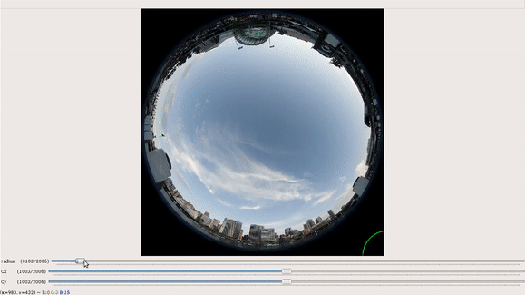

<p align="center">
  
</p>


<p align="center">
  <a href="https://github.com/kaustubh-sadekar/OmniCV-Lib/actions?query=workflow%3Acpp-build-test"></a>
  <a href="https://github.com/kaustubh-sadekar/OmniCV-Lib/actions?query=workflow%3Apython-build-test"></a>
  <a href="https://github.com/kaustubh-sadekar/OmniCV-Lib/actions?query=workflow%3ACD-PyPi"></a>
  <a href="https://badge.fury.io/py/omnicv"></a>
</p>


A **computer vision library for omnidirectional(360&deg;) cameras**. This package is divided into two parts:
* **Basic functions** for inter-conversion of different types of mappings associated with omni directional cameras, virtual reality and 360&deg; videos, like cubemap, spherical projections, perspective projection and equirectangular projection.
* **Software applications** like **360&deg; video viewer**, **fisheye image generator** with variable intrinsic properties, GUI to determine **fisheye camera paraeters**.

##### Objectives of the OmniCV library
This library has been developed with the following obectives:
* **Quick and easy** to use API to encourage and enhance the research in areas using omni directional cameras.
* To support **real time** applications.
* Provide extensions in **python** as well as **C++** as they are the languages used by researchers.
* Provide **ROS package** to use in robotics research.

[*Click here to know more about omni directional cameras*](omnidir-cameras.md)

## Highlights 
* Detailed [examples](Examples/README.md) and [application notes](applications/README.md) to understand how to use the package.
* Installation guide for 
  * Python version
  * C++ version
  * ROS packge
* [**Detailed documentation**](https://kaustubh-sadekar.github.io/OmniCV-Lib/).

## Output Gallery

Some interesting 360&deg; video effects

Arround the world effect             |  Hollow world effect 
:-------------------------:|:-------------------------:
  |  

Creating custom fisheye images 

Equirect2Fisheye             |  Custom image using GUI 
:-------------------------:|:-------------------------:
  |  

GUI to determine fisheye camera parameters

GUI to get radius        |  GUI to get fisheye params
:-------------------------:|:-------------------------:
  |  

Horizontal and vertical orientation viewing mode support

360&deg; viewer mode 1        |  360&deg; viewer mode 2
:-------------------------:|:-------------------------:
  |  


## Index to theory, examples and application notes
* [Types of omni directional cameras](omnidir-cameras.md)
* [Examples](Examples/README.md)
  * Equirectangular image to fisheye or pinhole camera image.
  * Fisheye image to equirectangular image.
  * Equirectangular image to cube map image (horizontal or dice format)
  * Convert cube map image (horizontal or dice format) to equirectangular image.
  * Convert equirectangular image to perspective image with desired field of view and viewing angles.
  * Convert cubemap image to perspective image with desired field of view and viewing angles.
* [Application notes](applications/README.md)
  * GUI to control focus, distortion and view orientation to generate different kinds of distortion effects and get images with different properties.
  * GUI to determine fisheye camera parameters like aperture and fisheye radius for further conversions.
  * GUI to view an equirectangular image in 360&deg; format with control trackbars to change FOV(Field Of View) and viewing angles. (You can download any 360&deg; video **from youtube** and view it using the GUI and **enjoy the 360&deg; viewing experience**).

## Installation guide
A custom make file has been written which provides quick and easy options for installing and testing the library.

```shell

    git clone https://github.com/kaustubh-sadekar/OmniCV-Lib
    cd OmniCV-Lib/omnicv/
    # To build c++ as well as python files
    make build-all
    # To build only python files
    make build-python
    # To build only c++ files
    make build-cpp
 ```

Installing OmniCV in a virtual environment using pipenv. Pipfile and Pipfile.lock files have been provided. Copy both the files to the present working directory. Then simply run the following commands to setup OmniCV in a local environment.

```shell

    pipenv install
    pipenv shell    
```

## Running Tests

There are two types of tests provided for users. Being a vision based package visual tests have also been provided.

To run non-visual tests

```shell

    cd OmniCV-Lib/omnicv/
    # To test only python extension of the project
    make test-py
    # To test only c++ extension of the project
    make test-cpp
    # To test python as well as c++ extension of the project
    make test-cpp
```

To run visual tests

```shell

    cd OmniCV-Lib/omnicv/
    # To run visual test only python extension of the project
    make test-py-gui
    # To run visual test only c++ extension of the project
    make test-cpp-gui
    # To run visual test python as well as c++ extension of the project
    make test-all-visual
```

##### ROS Nodes
To build the ROS nodes follow these steps:
* Create a folder named omnicv in your ros workspace where you have your other ros packages

```shell
roscd src/
mkdir omnicv
```
* Add the contents present inside ros_files folder to the omnicv folder created in the previous step.
* Build the workspace.

```shell
cp OmniCV/ros_files/ [PATH TO ROS WORKSPACE]/src/omnicv/
roscd
catkin_make
```
```
